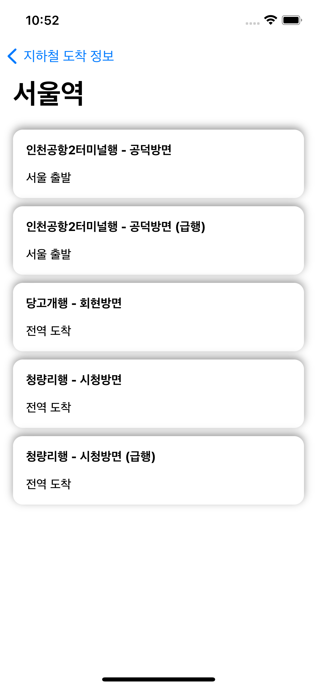

# SubwayStation

서울 열린데이터 광장의  지하철 관련 API를 사용하여 역이름을 검색하고
실시간 도착정보를 알수 있는 샘플앱입니다.

API 관련 링크
- [서울시 지하철역 정보 검색 (역명)](https://data.seoul.go.kr/dataList/OA-121/S/1/datasetView.do)
- [서울시 지하철 실시간 도착정보](https://data.seoul.go.kr/dataList/OA-12764/F/1/datasetView.do)

### API 이슈

역명 검색에는 서울역으로 결과가 나오지만 실시간 도착정보 API 에서는 서울이라고 리퀘스트를 보내야지만 정상적으로 되기 때문에
마지막 글자가 역으로 끝나면 지워주는 로직이 들어가있습니다. 

